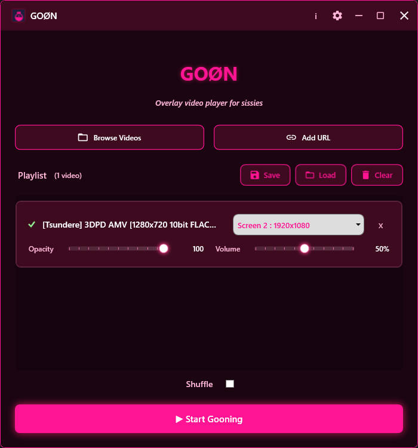

# GOØN v1.0

A specialized video player designed for multi-monitor playback with high-performance overlay capabilities for desktop.

## Features
- **Multi-Monitor Support**: Assign different videos to specific screens or span across "All Monitors".
- **Transparent Overlays**: High-performance players that run directly on your desktop background.
- **Truly Portable**: Automatic local data storage in `Data/` folder; falls back to `%AppData%` only if restricted.
- **Deep Web Integration**: Integrated `yt-dlp` support for seamless streaming from major media sites.
- **Panic Hotkey**: Instantly clear all active players (Default: `Ctrl+Shift+End`).

## Dependencies
- **.NET 8 Desktop Runtime**: This app requires the [.NET 8 Desktop Runtime](https://dotnet.microsoft.com/download/dotnet/8.0) to be installed.
- **Bundled Tools**: `ffmpeg` and `yt-dlp` are already included in this package.

## Quick Start
1. Extract the contents of this zip to a folder.
2. Run `GOON.exe`.
3. Drag and drop videos or paste URLs to get started.

## Notes
- **Distribution**: Distributed as a folder-based bundle for maximum UI stability on .NET 8.
- **Data Storage**: If the app cannot create a local `Data/` folder, it will fall back to using `%AppData%\GOON`.

---
*Support the development on [Ko-fi](https://ko-fi.com/vexfromdestiny)*
